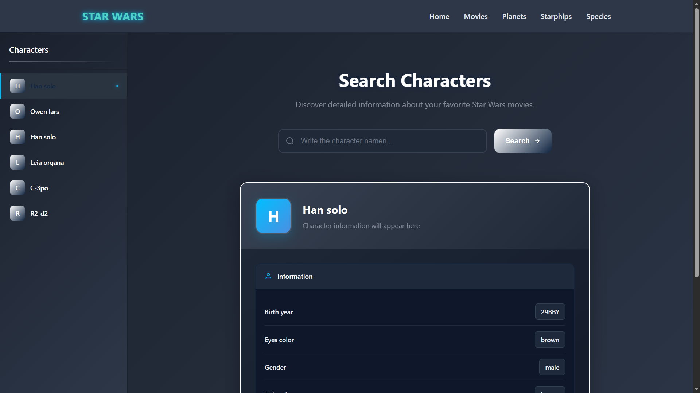

# Star Wars API Explorer

A Flask-based web application that allows users to explore Star Wars data including characters, movies, planets, starships, and species. The application serves as a frontend to the [SWAPI (Star Wars API)](https://www.swapi.tech/).

## Screenshots


*Main page of the Star Wars API Explorer*


*Character details view*

## Features

- Browse Star Wars characters with detailed information
- Explore Star Wars movies and their details
- Discover planets from the Star Wars universe
- View information about different starships
- Learn about various species in the Star Wars galaxy
- Responsive design that works on desktop and mobile devices

## Technologies Used

- **Backend**: Python 3.x, Flask
- **Frontend**: HTML5, CSS3, JavaScript
- **APIs**: [SWAPI - The Star Wars API](https://www.swapi.tech/)
- **Deployment**: Docker (Dockerfile included)

## Prerequisites

- Python 3.6 or higher
- pip (Python package installer)
- Git
- Docker (optional, for containerized deployment)

## Installation

### Method 1: Using Docker (Recommended)

1. Clone the repository:
   ```bash
   git clone https://github.com/yourusername/star-wars-api-explorer.git
   cd star-wars-api-explorer
   ```

2. Build and run the Docker container:
   ```bash
   docker build -t star-wars-api .
   docker run -d -p 5000:5000 star-wars-api
   ```

3. Open your browser and navigate to: http://localhost:5000

### Method 2: Manual Installation

1. Clone the repository:
   ```bash
   git clone https://github.com/yourusername/star-wars-api-explorer.git
   cd star-wars-api-explorer
   ```

2. Create a virtual environment:
   ```bash
   python -m venv venv
   source venv/bin/activate  # On Windows use: .\venv\Scripts\activate
   ```

3. Install dependencies:
   ```bash
   pip install -r requirements.txt
   ```

4. Run the application:
   ```bash
   python star.py
   ```

5. Open your browser and navigate to: http://127.0.0.1:5000

## Project Structure

```
.
├── static/                # Static files (CSS, JS, images)
│   ├── css/              # Stylesheets
│   ├── js/               # JavaScript files
│   └── images/           # Image assets
├── templates/            # HTML templates
├── .gitignore           # Git ignore file
├── Dockerfile           # Docker configuration
├── requirements.txt     # Python dependencies
└── star.py             # Main application file
```

## API Endpoints

The application provides the following API endpoints:

- `/` - Home page
- `/personajes` - Star Wars characters
- `/peliculas` - Star Wars movies
- `/planetas` - Planets from the Star Wars universe
- `/naves` - Starships and vehicles
- `/especies` - Species information

## Contributing

Contributions are welcome! Please feel free to submit a Pull Request.

1. Fork the repository
2. Create your feature branch (`git checkout -b feature/AmazingFeature`)
3. Commit your changes (`git commit -m 'Add some AmazingFeature'`)
4. Push to the branch (`git push origin feature/AmazingFeature`)
5. Open a Pull Request

## License

This project is licensed under the MIT License - see the [LICENSE](LICENSE) file for details.

## Acknowledgments

- [SWAPI - The Star Wars API](https://www.swapi.tech/)
- [Flask](https://flask.palletsprojects.com/)
- [Star Wars](https://www.starwars.com/) for the amazing universe


